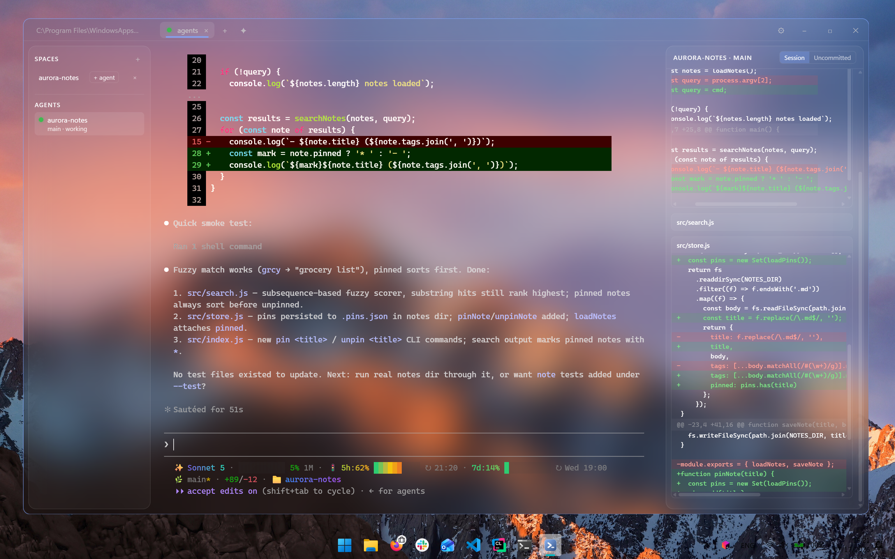
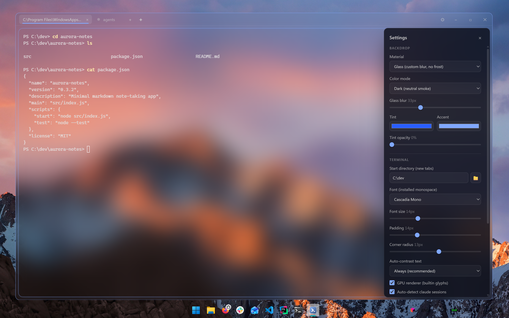

<p align="center">
  
</p>

<h1 align="center">Frost</h1>

<p align="center">
  A fully customizable acrylic terminal for Windows — with a built-in AI agent mode.<br/>
  Electron · xterm.js · ConPTY · PowerShell 7
</p>

---



## Why

Windows terminals let you pick a theme. Frost lets you own the whole surface:
real acrylic/glass backdrops you control down to blur radius and tint alpha,
hot-reloading config files, raw CSS injection — and a first-class mode for
running and supervising Claude Code agents with live status and diff watching.

## Features

- **Backdrop materials**
  - `acrylic` / `mica` / `tabbed` — native Windows backdrops
  - `acrylic-always` — native acrylic that **never dims on unfocus** (Frost
    re-applies the backdrop on blur)
  - `glass` — Frost's own backdrop: truly transparent window, wallpaper blurred
    in-app. Blur 0–100px, tint from fully clear to opaque, zero Windows frost
- **Hot-reload everything** — save `config/theme.json` or `config/theme.css`
  and the running window updates instantly. `theme.css` is raw CSS injected
  last: restyle anything
- **Agent mode** — a special tab for AI coding agents (Claude Code first):
  - run `claude` in any Frost terminal → it auto-registers as an agent with
    live status: working / **blocked (needs you)** / done / idle
  - diff watch panel: live green/red diff of the agent's repo — **Session**
    (everything since the agent started, survives commits) or **Uncommitted**
  - sessions persist: after a restart, one click re-opens the repo and runs
    `claude --continue`
  - optional worktree isolation per agent for parallel work on one repo
  - status comes from Claude Code hooks injected per-session via `--settings` —
    your global Claude config is never touched. Kill switch in settings
- **Terminal quality**: GPU renderer with builtin box-drawing glyphs,
  full-color emoji, Unicode 11 widths, auto-contrast for unreadable colors
  (Windows Terminal parity), tabs, split panes, font picker listing your
  installed monospace fonts

## Run

```
npm install
npm start
```

Requires Node 18+, Windows 11 for the acrylic/mica materials
(`glass` works anywhere), and [PowerShell 7](https://github.com/PowerShell/PowerShell)
(falls back to Windows PowerShell). Agent mode expects
[Claude Code](https://claude.com/claude-code) on PATH.

> **Smart App Control**: unsigned dev binaries (Electron) are blocked when SAC
> is enforcing. Dev on a SAC machine requires turning it off.

## Shortcuts

| Keys | Action |
|------|--------|
| `Ctrl+Shift+T` | New tab |
| `Ctrl+Shift+A` | New agent tab |
| `Ctrl+Shift+W` | Close pane (last pane closes tab) |
| `Alt+Shift+=` / `Alt+Shift+-` | Split right / down |
| `Ctrl+Tab` / `Ctrl+Shift+Tab` | Next / previous tab |
| `Ctrl+,` | Settings panel |
| `Ctrl+Shift+C` / `Ctrl+Shift+V` | Copy / paste |
| Right-click | Copy selection, else paste |

## Configuration



Created with defaults on first run, all hot-reloading:

- `config/theme.json` — material, colors, blur, tint, fonts, cursor, padding,
  corner radii, start directory, ANSI palette, agent auto-detect
- `config/theme.css` — raw CSS, injected last, overrides anything
- `config/agents.json` — saved repos ("spaces") for agent mode
- `config/sessions.json` — resumable agent sessions (managed automatically)

The settings panel (`Ctrl+,`) edits `theme.json` for you.

## License

MIT
