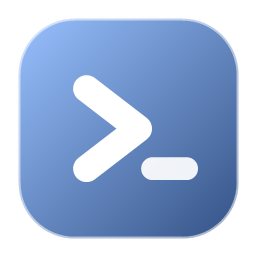
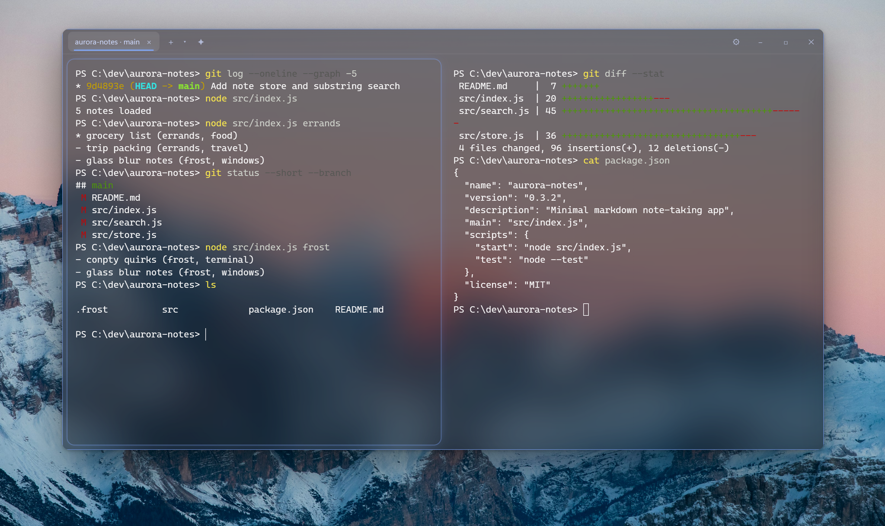
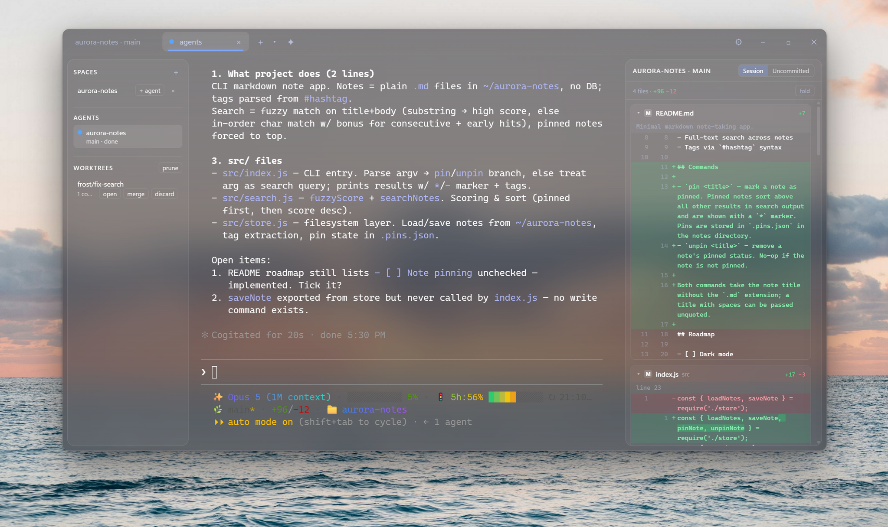
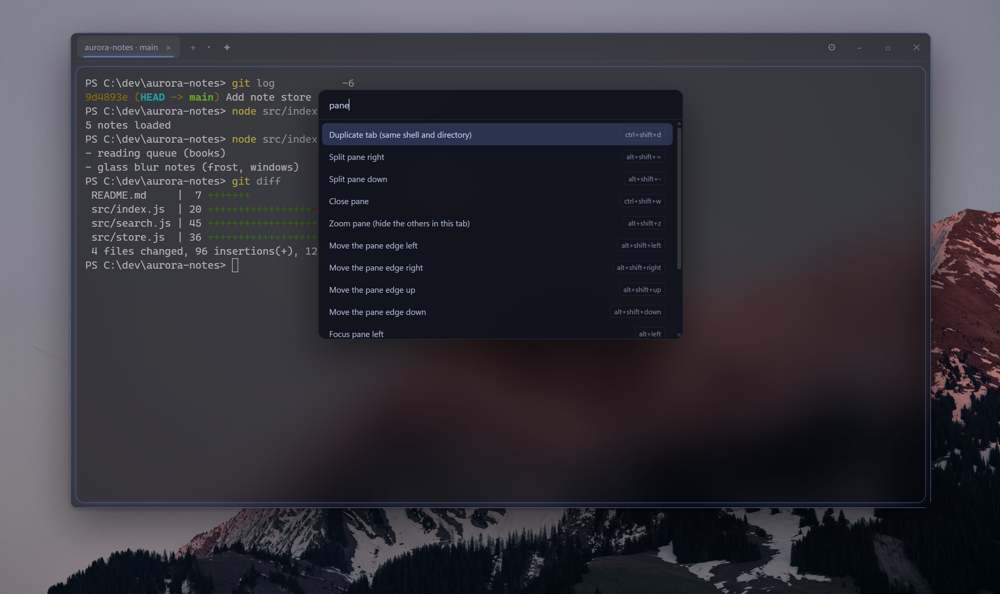
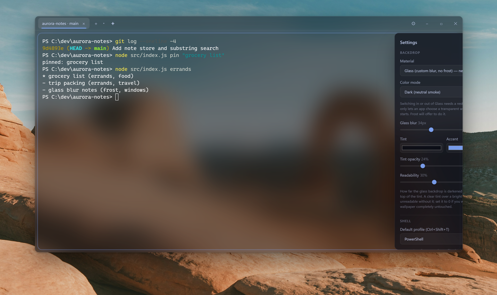
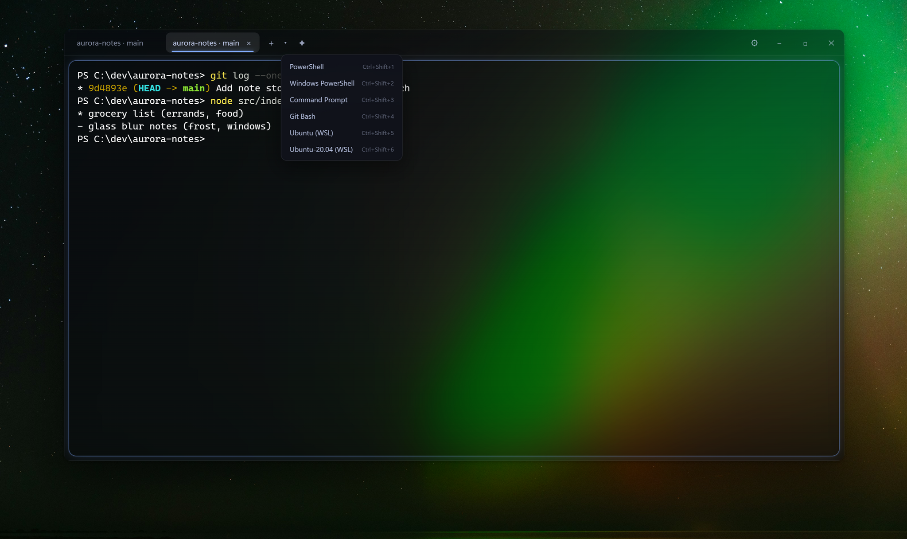

<p align="center">
  
</p>

<h1 align="center">Frost</h1>

<p align="center">
  A fully customizable acrylic terminal for Windows — with a built-in AI agent mode.<br/>
  Electron · xterm.js · ConPTY · PowerShell 7
</p>

<p align="center">
  <a href="https://github.com/azekyoo/frost/releases/latest"><strong>Download for Windows</strong></a>
  ·
  <a href="#install">Install</a>
  ·
  <a href="#shortcuts">Shortcuts</a>
  ·
  <a href="#configuration">Configuration</a>
</p>

---



## Why

Windows terminals let you pick a theme. Frost lets you own the whole surface:
real acrylic/glass backdrops you control down to blur radius and tint alpha,
hot-reloading config files, raw CSS injection — and a first-class mode for
running and supervising Claude Code agents with live status and diff watching.

## Features

- **Shell profiles** — PowerShell 7, Windows PowerShell, cmd, Git Bash and every
  WSL distro are detected on first run and written into `theme.json`. Add your
  own (shell, args, cwd, env) by editing that list. The `▾` button next to `+`
  lists them, `Ctrl+Shift+1…9` opens the Nth, and splitting a pane keeps the
  shell you were already in
- **Tab titles that say something** — each tab shows `directory · branch`, live.
  The shell reports its cwd on every prompt (OSC 9;9, injected by wrapping
  whatever prompt your profile already installed — starship and oh-my-posh keep
  working), and the branch is read straight out of `.git/HEAD`, so no `git`
  process runs per prompt. A program that sets its own title (claude, ssh, vim)
  still wins. Splits and `Ctrl+Shift+D` inherit the current directory
- **Ctrl+click a path or a URL** — `src/search.js:45:12` from a stack trace, a
  grep hit, a `File "app.py", line 118` traceback or a bare `README.md` opens in
  your editor at that line; links open in your browser. Candidates are only
  underlined once they're confirmed to exist on disk, so prose doesn't light up.
  Nothing found in terminal output is ever passed through a shell, and only
  `http`, `https` and `mailto` are ever opened
- **Knows where your commands are** — the prompt hooks emit command marks, so
  Frost knows where each command started and how it ended. Failed commands get a
  red tick in the scrollbar, successful ones green, and `Ctrl+Shift+↑` / `↓`
  jump between them however far you've scrolled
- **Tells you when a long command finishes** — if a command ran longer than your
  threshold and Frost is in the background, you get a notification and a taskbar
  flash. Timed from the same prompt hook that drives tab titles, so there's no
  extra shell integration to install
- **Command palette and keys that are yours** — `Ctrl+Shift+P` lists every
  command beside the key it currently answers to. Rebind any of them in
  `keybindings.json`, which hot-reloads. Bindings match on physical key position,
  so they land in the same place on any layout
- **Several windows** — `Ctrl+Shift+N`. Each window owns its own tabs and
  shells; the agent view stays unique across the app, so asking for it from a
  second window brings the one that has it to the front instead of splitting
  your agents in two
- **Opens where you're working** — `frost .` opens a tab in that directory, and
  the installer adds **Open Frost here** to the folder right-click menu. If Frost
  is already running you get a new tab, not a second window
- **Picks up where you left off** — every window comes back with its own size,
  position, maximized state, tabs and split layout, each pane reopened in the
  directory it was in. Written continuously, so a crash doesn't lose it. Toggle
  in settings; agent tabs stay out of it and keep their own resume list
- **Backdrop materials**
  - `acrylic` / `mica` / `tabbed` — native Windows backdrops
  - `acrylic-always` — native acrylic that **never dims on unfocus** (Frost
    re-applies the backdrop on blur)
  - `glass` — Frost's own backdrop: truly transparent window, wallpaper blurred
    in-app. Blur 0–100px, tint from fully clear to opaque, zero Windows frost.
    A separate **readability** floor darkens the backdrop behind text, so a clear
    tint stays legible over a bright wallpaper; set it to 0 to leave the
    wallpaper completely untouched
- **Hot-reload everything** — save `config/theme.json` or `config/theme.css`
  and the running window updates instantly. `theme.css` is raw CSS injected
  last: restyle anything
- **Agent mode** — a special tab for AI coding agents (Claude Code first),
  heavily inspired by the excellent [herdr](https://herdr.dev/):
  - run `claude` in any Frost terminal → it auto-registers as an agent with
    live status: working / **blocked (needs you)** / done / idle
  - diff watch panel: live green/red diff of the agent's repo — **Session**
    (everything since the agent started, survives commits) or **Uncommitted**
  - sessions persist: after a restart, one click re-opens the repo and runs
    `claude --continue`
  - **it tells you when it needs you** — a Windows notification and a taskbar
    flash when an agent goes blocked or finishes, raised only while Frost is in
    the background; clicking the notification jumps to that agent
  - optional worktree isolation per agent for parallel work on one repo, listed
    in a **Worktrees** section with its branch, how far ahead of the base branch
    it is and whether it's dirty — review it in the diff panel long after the
    agent has gone, then open, merge or discard it without leaving Frost
  - status comes from Claude Code hooks injected per-session via `--settings` —
    your global Claude config is never touched. Kill switch in settings
- **Terminal quality**: text hinted by the system rather than blended out of a
  GPU atlas — the difference shows on a translucent window — full-color emoji,
  Unicode 11 widths, a palette picked to stay readable through glass (with
  optional auto-contrast for one that isn't), tabs, split panes, font picker
  listing your installed monospace fonts. A GPU renderer is one tick away in
  settings if you push enough output to want it



## Install

Grab `Frost-Setup-<version>.exe` from
[Releases](https://github.com/azekyoo/frost/releases) — a per-user install, no
admin needed. `Frost-<version>-portable.exe` runs with no install at all.

The installer also adds:

- **Open Frost here** in the folder right-click menu (on a folder, or on empty
  space inside one)
- **`frost`** on your PATH — `frost .` opens a tab in that directory. If Frost is
  already running, it opens a new tab there instead of a second window

Settings live in `%APPDATA%\Frost\config` for installed builds. Running from
source uses the repo's `config/` folder instead, so the two never collide.

Windows 11 is needed for the acrylic/mica materials (`glass` works anywhere), and
[PowerShell 7](https://github.com/PowerShell/PowerShell) is used when present
(falls back to Windows PowerShell). Agent mode expects
[Claude Code](https://claude.com/claude-code) on PATH.

> **The builds are unsigned.** SmartScreen will warn on first run — "More info"
> then "Run anyway". With Smart App Control *enforcing*, Windows blocks unsigned
> binaries outright and Frost can't run until you turn SAC off. Code signing
> needs a certificate this project doesn't have yet.

## Build from source

```
npm install
npm start            # run it
npm run dist         # installer + portable exe into dist/
npm run pack         # unpacked build only, faster
npm run shots        # re-render the screenshots above
npm run test:status  # end-to-end check of agent status reporting
```

`npm run test:status` drives a real Frost over the debugging protocol: it opens
an agent tab in the demo repo, runs `claude` for real, prompts it, and prints
every status transition with a timestamp — then clicks between panes and idles,
asserting neither invents activity. It costs one short Claude turn. Point it at
another repo with `FROST_SHOT_REPO`.

`npm run shots` drives real Frost instances over the debugging protocol — real
keystrokes into a real shell, real program output — then composites each capture
onto a generated landscape so the `glass` backdrop is shown doing its job.
Nothing in those images is mocked, and it leaves your own config, window layout
and desktop untouched. Pass a name to render one: `npm run shots -- palette`.

The agent scenario runs a **real Claude Code session** against the demo repo,
because agent mode isn't itself without one — so that shot costs a little API
usage, and the renderer refuses to capture it while Claude's start-up banner is
still on screen, which would put your account name and organisation in the image.

Requires Node 22.12+, which is what Electron 43 asks for. Tagged builds come out
of [CI](.github/workflows/release.yml) on `windows-latest`, so you only need this
to hack on Frost.

`npm install` runs `tools/patch-xterm-alpha.js`, which edits three expressions in
`@xterm/addon-webgl`. Its WebGL renderer hard-codes a background rectangle's
alpha to 1, and italic and dim are stored as flags on a cell's *background*
field — so on the transparent theme `glass` needs, every italic or dim cell was
painted into an opaque black box. PowerShell's inline prediction is dim and
italic, so it was the visible symptom. Filed upstream as
[xtermjs/xterm.js#6116](https://github.com/xtermjs/xterm.js/issues/6116); the
script is idempotent and exits non-zero if a future release stops matching, so an
upgrade fails loudly rather than quietly bringing the box back. Setting
`"gpuRenderer": false` avoids it too — the DOM renderer never had the bug.

## Shortcuts

`Ctrl+Shift+P` opens the command palette, which lists every command next to the
key it currently answers to — that, not this table, is the authoritative list.



| Keys | Action |
|------|--------|
| `Ctrl+Shift+P` | Command palette |
| `Ctrl+Shift+N` | New window |
| `Ctrl+Shift+T` | New tab (default profile) |
| `Ctrl+Shift+1` … `9` | New tab with the Nth shell profile |
| `Ctrl+1` … `8` / `Ctrl+9` | Go to tab N / last tab |
| `Ctrl+Tab` / `Ctrl+Shift+Tab` | Next / previous tab |
| `Ctrl+Shift+A` | New agent tab |
| `Ctrl+Shift+D` | Duplicate tab (same shell, same directory) |
| `Ctrl+Shift+W` | Close pane (last pane closes tab) |
| `Alt+Shift+=` / `Alt+Shift+-` | Split right / down (inherits directory) |
| `Alt+←` `→` `↑` `↓` | Move focus to the pane in that direction |
| `Ctrl+=` / `Ctrl+-` / `Ctrl+0` | Zoom the whole UI in / out / reset — remembered per monitor |
| `Ctrl+F` | Search buffer |
| `Ctrl+Shift+K` | Clear buffer |
| `Ctrl+Shift+↑` / `↓` | Jump to previous / next command |
| `Ctrl+,` | Settings panel |
| `Ctrl+Shift+C` / `Ctrl+Shift+V` | Copy / paste |
| `Ctrl+click` | Open a file path in your editor, or a URL in your browser |
| Right-click | Copy selection, else paste |

Every one of them is remappable in `config/keybindings.json`:

```json
{
  "bindings": [
    { "keys": "ctrl+t", "command": "tab.new" },
    { "keys": "ctrl+shift+k", "command": null },
    { "keys": "alt+2", "command": "tab.go", "args": { "index": 2 } }
  ]
}
```

Reusing a built-in's `keys` replaces it, `"command": null` unbinds it, and the
file hot-reloads on save. Keys are matched on physical position, so a binding
lands on the same key on every keyboard layout.

## Configuration



Created with defaults on first run, all hot-reloading. In `%APPDATA%\Frost\config`
for an installed build, in the repo's `config/` when running from source:

- `config/theme.json` — material, colors, blur, tint, `glassReadability`, fonts, cursor, `scroll`, padding,
  corner radii, start directory, ANSI palette, agent auto-detect, and
  `profiles` / `defaultProfile`:

  ```json
  {
    "id": "ubuntu",
    "name": "Ubuntu",
    "shell": "C:\\Windows\\System32\\wsl.exe",
    "args": ["-d", "Ubuntu", "--cd", "~"],
    "cwd": "",
    "env": {},
    "agentWrapper": "none"
  }
  ```

  `agentWrapper` says which dialect the session-local `claude` wrapper is
  written in: `powershell`, `bash`, or `none` (no agent auto-detect in that
  shell — agent tabs then use the first profile that supports it)

  

  `notify` controls background alerts:
  `{ "agentBlocked": true, "agentDone": true, "commandSeconds": 20 }`.
  `commandSeconds` is the threshold for the long-command notification, and `0`
  turns it off.

  `editor` is the command Ctrl+click uses, as an argv template — for example
  `"editor": "code --goto {file}:{line}:{column}"`. `{file}`, `{line}` and
  `{column}` are substituted as whole arguments and never handed to a shell.
  Empty means the first of `code`, `code-insiders`, `cursor`, `windsurf`, `subl`,
  `idea` or `nvim-qt` found on PATH, falling back to whatever Windows associates
  with the file
- `config/theme.css` — raw CSS, injected last, overrides anything
- `config/keybindings.json` — key overrides (see [Shortcuts](#shortcuts))
- `config/agents.json` — saved repos ("spaces") for agent mode
- `config/sessions.json` — resumable agent sessions (managed automatically)
- `config/window.json` — window geometry and tab layout (managed automatically)
- `config/zoom.json` — UI zoom per monitor, keyed by resolution and scale (managed automatically)

The settings panel (`Ctrl+,`) edits `theme.json` for you.

## License

MIT
