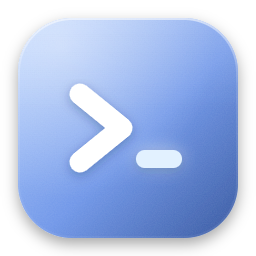
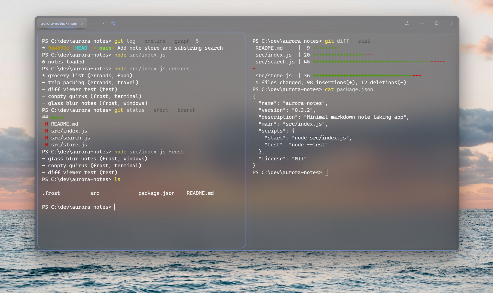
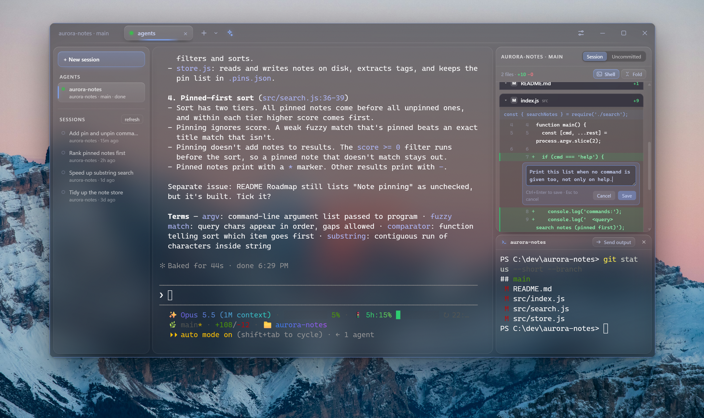
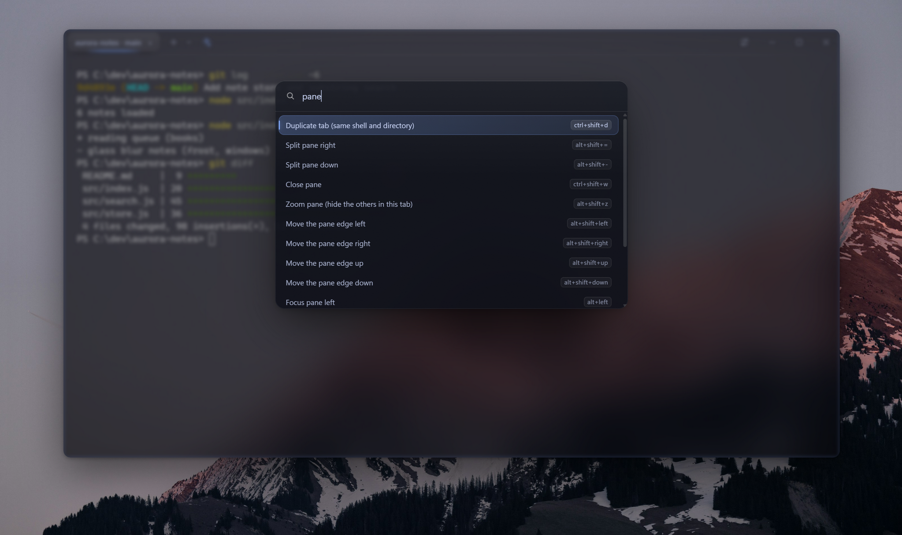
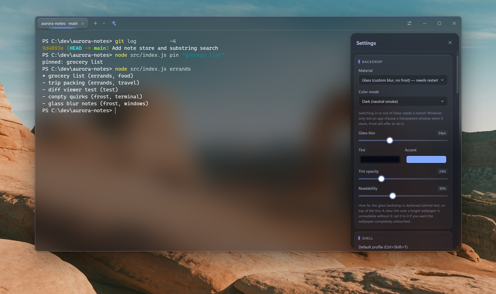

<p align="center">
  
</p>

<h1 align="center">Frost</h1>

<p align="center">
  A glass terminal for Windows — with a built-in mode for running Claude Code agents.
</p>

<p align="center">
  <a href="https://github.com/azekyoo/frost/releases/latest"><strong>Download for Windows</strong></a>
  ·
  <a href="#install">Install</a>
  ·
  <a href="docs/GUIDE.md">Full guide</a>
</p>

---


## Why Frost

Most terminals let you pick a theme. Frost lets you own the whole surface: a real
glass or acrylic backdrop tuned down to blur and tint, config that hot-reloads,
raw CSS for anything else — and an agent mode that shows what Claude Code is
doing while it does it.

## Highlights

- **Glass, acrylic or mica** — Frost's own blurred-wallpaper glass, or the native
  Windows materials, with a readability control so text stays legible on any
  wallpaper
- **Tabs that say where you are** — every tab shows `directory · branch`, live.
  Drag tabs to reorder them, between windows, or out into a new one; the shells
  keep running
- **Knows your commands** — failed and successful commands are marked in the
  scrollbar, `Ctrl+Shift+↑/↓` jumps between them, `Ctrl+Shift+O` copies one
  command's output
- **Ctrl+click a path** from a stack trace or grep result to open it in your
  editor at that line
- **Every shell detected** — PowerShell 7, Windows PowerShell, cmd, Git Bash and
  your WSL distros
- **Typing effects, made of ice** — optional: what you type freezes, what you
  delete dissolves, what you copy is scanned
- **Yours to rebind and restyle** — a command palette for everything, remappable
  keys, and `theme.json` / `theme.css` that apply the moment you save
- **Updates itself** quietly, and only installs when you quit



## Agent mode

Run `claude` in any tab and it becomes an agent with live status — working,
**blocked (needs you)**, done — and a Windows notification when it needs you.



- **Diff watch** — a live diff of just what the agent changed this session
- **Review it in place** — comment on any line of the diff, then send every
  comment to the agent as one message
- **A shell per session**, docked under the diff, that stays running while you
  switch between agents
- **Send it what broke** — a failed command in that shell, its output, or
  whatever you've selected goes to the agent in one click (`Ctrl+Shift+S`)
- **Resume any past session** in one click, or start a new one in any folder

## Install

Download `Frost-Setup-<version>.exe` from
[Releases](https://github.com/azekyoo/frost/releases/latest). It installs for
your user only, so no admin is needed. There's also a portable exe that needs no
install.

The installer adds **Open Frost here** to the folder right-click menu and `frost`
to your PATH (`frost .` opens a tab in the current folder).

Needs Windows 11 for acrylic and mica (glass works anywhere). Agent mode needs
[Claude Code](https://claude.com/claude-code) on PATH.

> **The builds are unsigned.** SmartScreen warns on first run — click "More
> info", then "Run anyway". With Smart App Control enforcing, Windows blocks
> Frost until SAC is turned off.

## A few keys



| Keys | Action |
|------|--------|
| `Ctrl+Shift+P` | Command palette — every command and its key |
| `Ctrl+Shift+T` / `Ctrl+Shift+N` | New tab / new window |
| `Ctrl+Shift+A` | Agent tab |
| `Alt+Shift+=` / `Alt+Shift+-` | Split right / down |
| `Alt+Shift+Z` | Zoom a pane over its tab |
| `Ctrl+F` | Search the buffer |
| `Ctrl+,` | Settings |

The full table, and how to rebind keys, is in the
[guide](docs/GUIDE.md#shortcuts).

## Make it yours



The settings panel covers the backdrop, fonts, colours and behaviour. For
everything else there's `theme.json`, `theme.css` and `keybindings.json` — all
explained in the [guide](docs/GUIDE.md#configuration).

## Build from source

```
npm install
npm start      # run it
npm run dist   # installer + portable exe into dist/
```

Needs Node 22.12+. Tests, screenshots and build notes are in the
[guide](docs/GUIDE.md#build-from-source).

---

**Want every detail?** The [full guide](docs/GUIDE.md) covers each feature,
every shortcut and every setting.

MIT license
